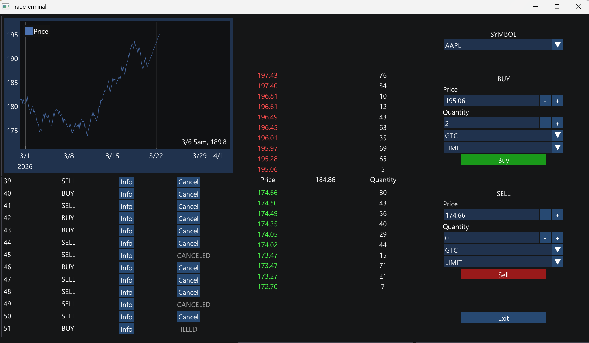

# Limit Order Book

> A high-performance C++ limit order book with a lock-free MPSC queue and a dedicated matching thread per symbol.



---

## What is a Limit Order Book?

A **Limit Order Book (LOB)** is the core data structure of every financial exchange. It maintains two sorted collections of orders:

- **Bids** — buy orders, sorted by price descending (highest price has priority)
- **Asks** — sell orders, sorted by price ascending (lowest price has priority)

When a new order arrives, the matching engine checks whether it can be filled against the opposite side. If a buy price ≥ the best ask, a trade executes. Otherwise, the order rests in the book waiting for a counterpart.

---

## Architecture

```
UI / ClientSimulator / TcpServer
        │
        ▼
CoreEngine::CreateOrder(...)
        │
        ▼
OrderRouter::Route(request)
        │
        ▼
LockFreeQueue<OrderPod, N>      
        │
        ▼
SymbolWorker::Run()              
        │
        ▼
MatchingEngine<StorageType>     
        │
        ▼
BinaryOrderBook | MultisetOrderBook
```

Every symbol has its own pool, queue, storage, and worker thread — fully isolated from every other symbol.

### Core Components

```
include/
├── Concurrency/
│   ├── ClientSimulator.h
│   ├── LockFreeQueue.h
│   ├── OrderQueue.h
│   ├── SymbolWorker.h
│   └── Worker.h
├── Domain/
│   ├── order.h
│   ├── OrderPod.h
│   ├── OrderRequest.h
│   ├── Time.h
│   ├── trade.h
│   └── TradePod.h
├── Engine/
│   ├── CoreEngine.h
│   └── MatchingEngine.h
├── Memory/
│   └── OrderPool.h
├── Networking/
│   ├── Protocol.h
│   └── TcpServer.h
├── Routing/
│   └── OrderRouter.h
├── Storage/
│   ├── BinaryOrderBookStorage.h
│   ├── IOrderBookStorage.h
│   └── MultisetOrderBookStorage.h
└── UI/
    ├── GraphPanel.h
    ├── OrderBookPanel.h
    ├── OrderEntryPanel.h
    ├── OrdersPanel.h
    └── TradeTerminal.h

src/
├── Concurrency/
│   ├── ClientSimulator.cpp
│   ├── OrderQueue.cpp
│   ├── SymbolWorker.cpp
│   └── Worker.cpp
├── Domain/
│   └── order.cpp
├── Engine/
│   └── CoreEngine.cpp
├── Memory/
│   └── OrderPool.cpp
├── Networking/
│   ├── Protocol.cpp
│   ├── TcpServer.cpp
│   └── TestServer.cpp
├── Routing/
│   └── OrderRouter.cpp
├── Storage/
│   ├── BinaryOrderBookStorage.cpp
│   └── MultisetOrderBookStorage.cpp
└── UI/
    ├── GraphPanel.cpp
    ├── OrderBookPanel.cpp
    ├── OrderEntryPanel.cpp
    ├── OrdersPanel.cpp
    └── TradeTerminal.cpp

Tests/
├── benchmarks/
│   ├── MultithreadedBenchmark.cpp
│   └── OrderBookBenchmarkv2.cpp
├── Concurrency/
│   ├── TestConcurrency.cpp
│   ├── TestLockFreeQueue.cpp
│   └── TestWorker.cpp
├── Domain/
│   └── test_order.cpp
├── Engine/
│   ├── TestCoreEngine.cpp
│   └── TestMatchingEngine.cpp
├── Memory/
│   └── TestOrderPool.cpp
├── Networking/
│   ├── TestProtocol.cpp
│   └── TestTcpServer.cpp
├── Routing/
│   └── TestOrderRouter.cpp
├── Storage/
│   ├── test_binaryorderbook.cpp
│   └── test_multiset_storage.cpp
├── FullTest.cpp
└── TestEndToEnd.cpp

scripts/
└── python_client.py

main.cpp
```

### Threading Model

- **One worker thread per symbol** — the only thread that ever touches that symbol's memory pool or order book
- **Lock-free queue per symbol** — producers (UI, TCP clients, background simulators) push without ever blocking each other
- **One registry mutex** — contested only when a brand-new symbol is created, never on the hot path
- **No writer-vs-writer contention, anywhere** — there's exactly one writer per symbol by construction

### Why the Bitmap Index

Prices map to bits across a 4-level index (`312,501 × 4,884 × 77 × 2` words). Finding the best bid is finding the highest set bit — `__builtin_clzll`, one instruction per level, always exactly 4 steps regardless of book depth. True O(1). A `std::multiset` reference implementation is kept alongside it — the right choice depends on the traffic pattern (see [Benchmarks](#benchmarks)).

---

## Benchmarks

All numbers from Release builds, 5 repetitions, on a quiet 8-core machine.

### Bitmap vs Multiset

| Operation | At 90k book depth | Winner |
|---|---|---|
| `AddOrder` | Binary ~1.2× faster | Binary |
| `GetBestBid` | Multiset ~3× faster | Multiset |
| `CanFillQuantity` | roughly tied | — |
| Full pipeline | Binary ~1.3× faster | Binary |

### Round-Trip Latency

20,000 samples, single producer, guaranteed-immediate-match liquidity:

| p50 | p90 | p99 | p99.9 | max |
|---|---|---|---|---|
| ~5.0 µs | ~7.8 µs | ~12.6 µs | ~32 µs | ~100–500 µs |

### Sustained Load Test — 75 seconds, full system

75% `MARKET` orders, 25% `LIMIT GTC` on a real spread, with active cancellation keeping book depth stable (~2,000 resting orders/symbol) across 8 parallel symbols:

```
Orders/sec:   936,334
Matches/sec:  808,893
Volume/sec:   4,565,190
Cancels/sec:  109,911
```

---

**Dependencies** — CMake ≥ 3.20, C++20, Google Benchmark, Google Test, ImGui, ImPlot.